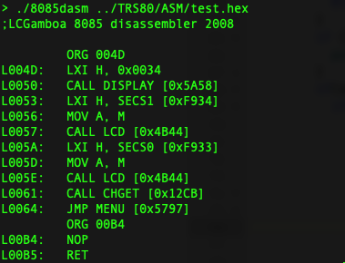
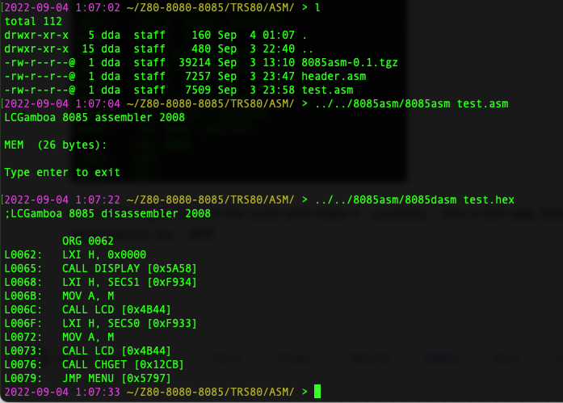

# 8085asm - Simple 8085/8080 assembler and disassembler

Simple 8085 assembler and disassembler for didatic use. `8085asm` generates the map file and intel hex file. It supports the EQU, ORG, DB, DS and END directives.

The 8085toZ80 application is a translator of 8085asm(8080) to z80asm.

## The Fork

I have forked this repository to improve and add to the assembler and disassembler. The first thing I did was to add the name of known (to me at least, there may be more) ROM functions and useful variables. There's a `header.asm` file with lots of `EQU`s, which will help you make your code more readable. Similarly, there's a `hex2label.h` include file for the disassembler, and the code has been updated to make use of the function labels:



I am planning to rework the code and make it – possibly – into a GUI app, backed by the 2 command-line applications. So... WIP.

In between, it seems to work:



## UPDATES

**2022/09/04**

I've added the known function and variable names to the compiler as labels, and they are recognized without the help of `EQU`s. A simple test code like this compiles as follows. I also added the creation of a plain binary file, with the `.co` extension.

```asm
	ORG 0xDA00
BEGIN:	LXI H, MESSAGE ;set HL pointer to start of message data
	CALL DISPLAY       ;display message
	LXI H, SECS1 ; SECS+1 = 0xF933+1 = 0xF934
	MOV A, M
	CALL LCD
	LXI H, SECS0
	MOV A, M
	CALL LCD
	CALL CHGET
	JMP MENU
MESSAGE:	DS "TIME = "
	DB 0
```
----->

```bash
> 8085asm test0.asm
LCGamboa 8085 assembler 2008

* Saving test0.map:
   Saving SYMBOLIC TABLE.
* RAM occupied:  (35 bytes):
* Saving test0.hex and test0.co:
done!

> 8085dasm test0.hex -s DA1A
Data starts at da1a
;LCGamboa 8085 disassembler 2008

         ORG DA00
LDA00:   LXI H, 0xDA1A
LDA03:   CALL DISPLAY [0x5A58]
LDA06:   LXI H, SECS1 [0xF934]
LDA09:   MOV A, M 
LDA0A:   CALL LCD [0x4B44]
LDA0D:   LXI H, SECS0 [0xF933]
LDA10:   MOV A, M 
LDA11:   CALL LCD [0x4B44]
LDA14:   CALL CHGET [0x12CB]
LDA17:   JMP MENU [0x5797]
LDA1A:   DB 0x54 [T]
LDA1B:   DB 0x49 [I]
LDA1C:   DB 0x4d [M]
LDA1D:   DB 0x45 [E]
LDA1E:   DB 0x20 [ ]
LDA1F:   DB 0x3d [=]
LDA20:   DB 0x20 [ ]
LDA21:   DB 0x00 [.]

> hexdump -C test0.co
00000000  21 1a da cd 58 5a 21 34  f9 7e cd 44 4b 21 33 f9  |!...XZ!4.~.DK!3.|
00000010  7e cd 44 4b cd cb 12 c3  97 57 c3 54 49 4d 45 20  |~.DK.....W.TIME |
00000020  3d 20 00                                          |= .             |
```

DS has been fixed.

**2022/09/05**

I've added DW (Define Word), so you can now add little-endian 16-bit numbers. So `DW 1234,5678` will insert `34, 12, 78, 56`.

**Except that** I have also added number parsing for binary (`0b........` or `0B........`), decimal, and hexadecimal (`0x....`, `0X....`, or `....H`). So if you do `DW 1234` it'll insert `D2, 04`, as 1234 is `0x04D2`.

Once assembled and disassembled, the following code:

```asm
LXI H, 0B11110000
MVI A, 12
LXI H, 1234
```

will look like this:
 
```asm
LXI H, 0x00F0
MVI A, 0x0C
LXI H, 0x04D2
```

I've modified the arguments passed to `8085dasm`:

* `-f filename` to pass the name of the file to be disassembled. If you don't the code will ask again before aborting.
* `-d da00` Address of the data segment's start. Anything from this address onwards will be treated as `DB xx`.
Another option, `-x da00:da22`, which can be repeated multiple times, is being built: it will allow the user to set several ranges of addresses, like here from `0xda00` to `0xda22`, to be treated as data. This doesn't work yet. It will be mutually exclusive with the `-d` option.

**2022/09/14**

`8085asm` now also produces a BASIC program that loads the ASM and runs it for you:

```BASIC
10 AD = 55808
11 N = 40
12 FOR I = 1 TO N
13 READ X
14 POKE AD,X
15 AD=AD+1
16 NEXT I
17 CALL 55808
18 END

19 DATA 33,26,218,205,88,90,33,52,249,126,205,68,75,33,51,249
20 DATA 126,205,68,75,205,203,18,195,151,87,84,73,77,69,32,61
21 DATA 32,0,210,4,46,22,184,34
```

This should make it easier to load ASM code.

**2022/09/24**

The compiler now runs twice over the same code: the first time it compiles the code with the `ORG` that's given in the file. And since Jumps and Calls are not relative, any change to ORG without recompiling (ie by saving the code as is in RAM on the Tandy) would crash. Ask me how I know.

So once that's done, the code calculates the real `ORG` value, and saves the file in a copy, and runs the compile process a second time, over ***that*** file, producing a binary that can be safely saved in RAM with my LOAD_CO Xojo + Tandy [binary loader code](https://github.com/Kongduino/Load_CO).

```bash
> 8085asm HEXDUMP.asm
Opening file: HEXDUMP.asm
LCGamboa 8085 assembler 2008

* Saving HEXDUMP.map:
   Saving SYMBOLIC TABLE.
* RAM occupied:  (249 bytes):
* Saving HEXDUMP.hex, HEXDUMP.co and HEXDUMP.do:
File size: 249. This matches memc. Goodie.
CLEAR 256,62710
All done!


TOP is 0xf4f7. Rewriting source to HEXDUMP.copy.asm...
File HEXDUMP.co was deleted successfully.
File HEXDUMP.copy.asm was deleted successfully.
Opening file: HEXDUMP.asm
line = 	ORG; kwd = ORG
	ORG 0xF4F7
Done...
Compiling again...
   Saving SYMBOLIC TABLE.
* RAM occupied:  (249 bytes):
* Saving HEXDUMP.hex, HEXDUMP.co and HEXDUMP.do:
File size: 249. This matches memc. Goodie.
CLEAR 256,62710
All done!
```

**2022/09/26**

The compiler now ONLY runs twice over the same code if the computed TOP address after the first run differs from the source file's ORG address. If they're identical there's no need to run twice.

```sh
> 8085asm small\ wordle.asm
Opening file: small wordle.asm
LCGamboa 8085 assembler 2008

* Saving small wordle.map:
   Saving SYMBOLIC TABLE.
* RAM occupied:  (357 bytes):
* Saving small wordle.hex, small wordle.co and small wordle.do:
File size: 357. This matches memc. Goodie.
CLEAR 256,62602
All done!


TOP is 0xf48b. ORG is 0xf48b
Sweet. TOP = ORG, no need to recompile!
Done...
```

**2022/09/27**

The compiler saves the 2nd source file, if it recompiles, to `filename.ADDR.asm` (where `ADDR` is the ORG address), instead of `filename.copy.asm`.

```sh
> 8085asm test0.asm
Opening file: test0.asm
LCGamboa 8085 assembler 2008

* Saving test0.map:
   Saving SYMBOLIC TABLE.
* RAM occupied:  (1073 bytes):
* Saving test0.hex, test0.co and test0.do:
File size: 1073. This matches memc. Goodie.
CLEAR 256,61886
All done!


TOP is 0xf1bf. ORG is 0xf200
TOP & iaddr are different. Rewriting source to test0.f1bf.asm...
File test0.co was deleted successfully.
File test0.f1bf.asm was NOT deleted successfully.
Opening file: test0.asm
line = 	ORG; kwd = ORG
	ORG 0xF1BF
Done...
Compiling again...
   Saving SYMBOLIC TABLE.
* RAM occupied:  (1073 bytes):
* Saving test0.hex, test0.co and test0.do:
File size: 1073. This matches memc. Goodie.
CLEAR 256,61886
All done!
```

**2022/10/07**

The compiler tries to recognize single characters preceded by a quote as a numerical value. ie `CPI 'A` is equivalent to `CPI 0x41`. It *seems* to work alright, except when there's a label preceding the command. I need to work on that.

A new command-line option, `-X`, has been added: it is to prevent the compiler to recalculate the ORG address and recompile. This can be useful when you want to have two pieces of code in RAM at the same time. Two other options, on my TODO list [ie yet to be implemented], are (a) to provide instead a specific address at which to relocate the code, and (b) to provide a custom `HIMEM` value, ie ask the compiler to calculate the relocation address not based on the usual `62960`, but on the value passed on the command line: ie *please relocate this code just above the new HIMEM, xxxxx*.
